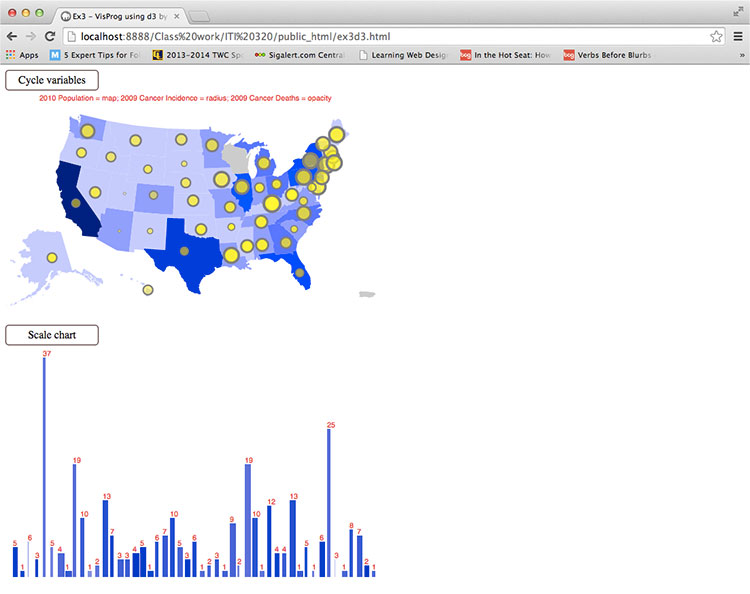

  
`School Work - Information Visualization Class - ITI-321`  

# Dates:  
2012 - 2013  
# Technologies:  
HTML5, CSS3, D3.js
# Description:  
This final assignment in D3.js has 2 parts (top and bottom) on the webpage.  

The top part shows a map of the U.S. with all 50 states.  The 3 datasets involved are 
* U.S. population in 2010
* cancer incidences in 2009
* cancer deaths in 2009  

They are represented in the graph by opacity of the map, radius of the circles and opacity of the circles respectively.  The higher opacity for the map and the circle means higher numbers for those datasets while the larger the radius of the circle means the higher the number for that dataset.  You can cycle through the variables by clicking on the "Cycle variables" button.  The note in red shows which datasets are represented at any given time.  

The bottom part shows a bar graph with a number on top.  The number represents the value of the current sort type.  The different sort types are 
* height of the bar
* width of the bar
* opacity of the bar  

Clicking on the bar cycles through the different sort types.  Clicking on the "Scale chart" button cycles through the different scaling values.  
# Screenshots:
  
